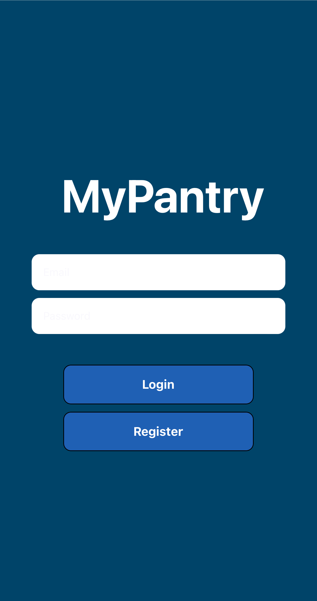
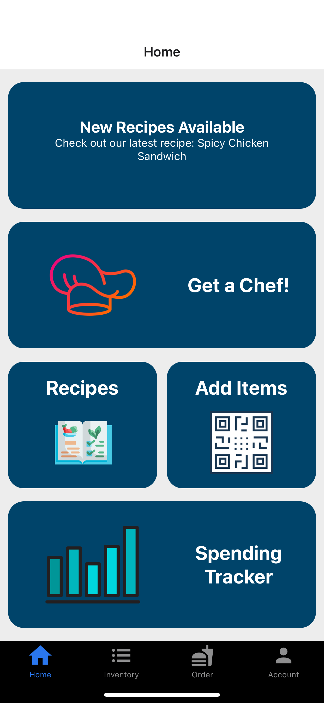

# My Pantry App Project

Please note that all files in the project are not shown and that what is listed in this respository are sample snippets from the project.

My Pantry App is a kitchen management app designed to help users keep track of their kitchen inventory at home, manage spending habits, generate personalized recipes, and request hot ready-to-eat homecooked meals from nearby certified chefs.

Login Screen

Home Screen
